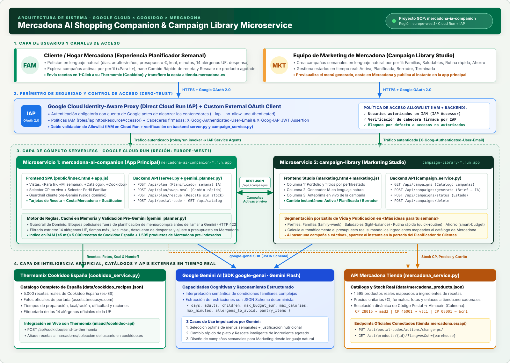
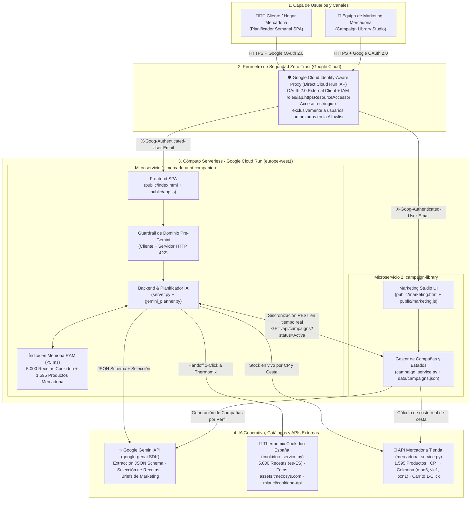

# Mercadona AI Shopping Companion & Campaign Library (`Google Cloud × Cookidoo × Mercadona`)

Plataforma compuesta por **dos microservicios serverless en Google Cloud Run**, protegidos mediante **Google Cloud Identity-Aware Proxy (IAP)** e impulsados por **Google Gemini**, que conecta el catálogo completo de **5.000 recetas de Thermomix (Cookidoo España)** con el catálogo y la disponibilidad en tiempo real de **Mercadona Tienda (`tienda.mercadona.es`)**.

---

## Esquema de Arquitectura



### Flujo de Datos e Integración entre Servicios (Mermaid)



---

## Componentes y Servicios Utilizados

| Capa | Servicio / Componente | Archivo(s) Clave | Función Principal |
| :--- | :--- | :--- | :--- |
| **Seguridad y Autenticación** | **Google Cloud Identity-Aware Proxy (IAP)** + **Google OAuth 2.0** | `server.py`, `campaign_service.py` | Protege ambos servicios en Cloud Run (`--iap --no-allow-unauthenticated`). Verifica identidad Google (`X-Goog-Authenticated-User-Email`) y restringe el acceso únicamente a los usuarios autorizados en la allowlist tanto en IAM (`roles/iap.httpsResourceAccessor`) como en el backend. |
| **Microservicio Principal** | **`mercadona-ai-companion`** (Cloud Run `europe-west1`) | `server.py`, `gemini_planner.py`, `public/app.js`, `public/index.html` | Experiencia para clientes: muestra campañas activas según el perfil familiar, valida que el prompt sea de ámbito culinario antes de invocar a Gemini, genera menús semanales personalizados, permite **Cambio rápido** de un plato y **Rescate de ingrediente sin stock**. |
| **Microservicio de Marketing** | **`campaign-library`** (Cloud Run `europe-west1`) | `campaign_service.py`, `public/marketing.js`, `public/marketing.html`, `data/campaigns.json` | Estudio para el equipo de Marketing de Mercadona: permite crear campañas en lenguaje natural por perfil (*Familias*, *Saludables*, *Rutina rápida*, *Ahorro*), cambiar su estado (*Activa*, *Planificada*, *Borrador*, *Terminada*) y publicarlas en vivo en la sección *«Más ideas para tu semana»* de la app principal. |
| **Inteligencia Artificial** | **Google Gemini (`google-genai` SDK)** | `gemini_planner.py`, `campaign_service.py` | Interpreta peticiones en lenguaje natural con salidas estructuradas (JSON Schema), filtra alérgenos/calorías/tiempos/presupuesto, justifica nutricionalmente la elección de platos y diseña campañas temáticas para Marketing. |
| **Recetas y Thermomix** | **Cookidoo España (`miaucl/cookidoo-api`)** | `cookidoo_service.py`, `data/cookidoo_recipes.json` | Catálogo completo en memoria de **5.000 recetas oficiales de Cookidoo España** con foto de portada (`assets.tmecosys.com`), tiempo, calorías, raciones y los 14 alérgenos de la UE. Incluye envío en 1-Click a la Thermomix del usuario (`POST /api/cookidoo/send-to-thermomix`). |
| **Catálogo y Stock Real** | **API de Mercadona Tienda (`tienda.mercadona.es/api/`)** | `mercadona_service.py`, `data/mercadona_products.json` | Catálogo de **1.595 productos verificados de Mercadona** mapeados a ingredientes reales. Resuelve dinámicamente el código postal al almacén logístico (*Colmena*, ej. `28016` → `mad3`), descuenta ingredientes de la despensa del usuario y prepara la cesta en 1-Click (`POST /api/mercadona/add-to-cart`). |

---

## Características Principales

1. **Planificación semanal por lenguaje natural con Guardrail Pre-Gemini**:
   - Antes de enviar cualquier petición a Gemini, un guardrail en cliente y servidor verifica que el prompt esté relacionado con la planificación de menús, recetas o lista de la compra (`HTTP 422` si está fuera de dominio).
   - Soporta número de cenas de la semana, miembros del hogar (adultos y niños), presupuesto máximo (€), límite de calorías por ración (kcal), tiempo máximo de preparación (min), los **14 alérgenos oficiales de la UE** e ingredientes que ya tienes en casa (descontados automáticamente de la cesta).
2. **Microservicio `campaign-library` conectado en tiempo real**:
   - Creación de campañas mediante lenguaje natural con Gemini, categorizadas por perfil (*Familias*, *Saludables*, *Rutina rápida*, *Ahorro*).
   - Gestión de estados en un clic (*Activa*, *Planificada*, *Borrador*, *Terminada*) y anteprima interactiva de la campaña.
   - Toda campaña en estado **Activa** se refleja automáticamente en la sección *«Más ideas para tu semana. Olvida el buscador. Compra según tu estilo de vida.»* de la aplicación principal.
3. **Catálogo de 5.000 Recetas de Cookidoo España + 1.595 Productos de Mercadona en RAM**:
   - Indexación en memoria al arranque del contenedor para filtrado instantáneo (`< 5 ms`) sin penalización de latencia.
   - Botón **«Envía a tu Thermomix»** en cada receta y botón **«Añadir al carrito de Mercadona (1-Click)»** para toda la compra semanal.
4. **Autenticación Zero-Trust con Google Cloud Identity-Aware Proxy (IAP)**:
   - Protege tanto `mercadona-ai-companion` como `campaign-library` con login real de Google OAuth 2.0 y lista blanca (`ALLOWED_USERS`) configurada en IAM (`roles/iap.httpsResourceAccessor`) y en el backend.

---

## Ejecución Local

```bash
# 1. Servicio principal (Mercadona AI Shopping Companion) en http://localhost:8080
python3 server.py

# 2. Microservicio de Marketing (Campaign Library) en http://localhost:8081/marketing
SERVICE_ROLE=campaign-library PORT=8081 python3 server.py
```

## Despliegue en Google Cloud Run con IAP

```bash
chmod +x deploy.sh
PROJECT_ID="mercadona-ia-companion" REGION="europe-west1" GEMINI_API_KEY="tu-api-key" ./deploy.sh
```
